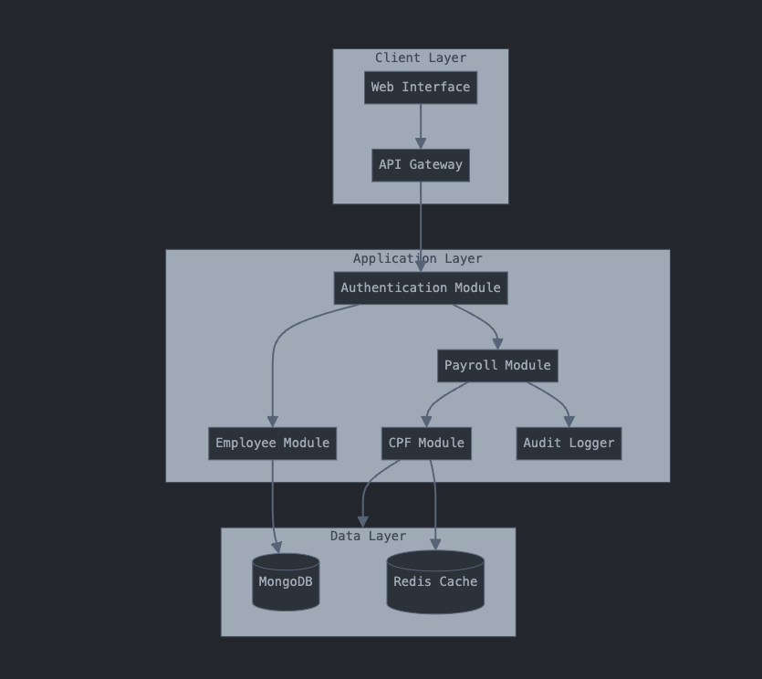
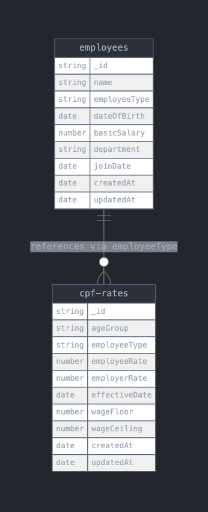

## System Architecture



## DB SChema



## Description

[Nest](https://github.com/nestjs/nest) framework TypeScript starter repository.

## Project setup

```bash
$ pnpm install
```

## Compile and run the project

```bash
# development
$ pnpm run start

# watch mode
$ pnpm run start:dev

# production mode
$ pnpm run start:prod
```

## Run tests

```bash
# unit tests
$ pnpm run test

# e2e tests
$ pnpm run test:e2e

# test coverage
$ pnpm run test:cov
```

# CPF Payroll System Strategy Document

**Project: Automated CPF Calculator for Singapore SMEs**  
**Date: January 2024**

## 1. Executive Summary

This document outlines the strategy for implementing an automated CPF calculation system for Singapore SMEs. The system will handle CPF contributions calculation, integrate with CPF Board's EZPAY, and manage payroll processing while ensuring compliance with Singapore's CPF regulations.

## 2. System Architecture

### 2.1 Technical Stack

- **Backend**: NestJS with TypeScript
- **Database**: MongoDB
- **Caching**: Redis
- **Testing**: Jest

### 2.2 Core Components

1. **Authentication Module**

   - JWT-based authentication
   - Role-based access control
   - Integration with company SSO (future phase)

2. **Employee Management Module**

   - Employee profile management
   - Employment history tracking
   - Document management

3. **CPF Calculation Module**

   - Real-time CPF calculation
   - Rate management system
   - Historical calculation tracking

4. **Payroll Processing Module**
   - Monthly payroll processing
   - Additional wage handling
   - CPF contribution submission
   - GIRO integration

### 2.3 Data Model

- **Employees Collection**: Personal and employment details
- **CPF Rates Collection**: Contribution rates and rules
- **Payroll Collection**: Monthly payroll records
- **Transactions Collection**: CPF submission history

## 3. Implementation Strategy

### 3.1 Phase 1: Core Foundation (1.5 weeks)

- Setup development environment
- Implement basic architecture
- Create employee and CPF rate management
- Basic API endpoints
- Unit tests setup

### 3.2 Phase 2: CPF Implementation (1.5 weeks)

- CPF calculation engine
- Rate management system
- Validation rules
- Integration tests
- Documentation

### 3.3 Phase 3: Payroll Processing (2 weeks)

- Monthly payroll processing
- Additional wage handling
- Bulk processing capability
- API documentation
- Performance testing

### 3.4 Phase 4: Integration & Deployment (1-2 weeks)

- EZPAY integration
- Security hardening
- Production deployment
- User acceptance testing
- Training documentation

## 4. Key Features and Functionalities

### 4.1 CPF Calculations

- Accurate calculation based on:
  - Employee type (Citizen/PR)
  - Age group
  - Wage type (Ordinary/Additional)
  - YTD contributions
  - Current CPF rates

### 4.2 Data Management

- Secure storage of sensitive data
- Audit logging
- Data encryption at rest
- Regular backups

### 4.3 Integration Capabilities

- CPF EZPAY submission format
- Bank GIRO integration
- Export capabilities
- API for third-party integration

## 5. Testing Strategy

### 5.1 Unit Testing

- Component-level testing
- Service layer coverage
- Calculation accuracy validation

### 5.2 Integration Testing

- API endpoint testing
- Database operations
- Cache functionality

### 5.3 Performance Testing

- Load testing for bulk operations
- Response time benchmarking
- Concurrent user handling

## 6. Security Measures

- Data encryption
- Role-based access control
- Audit logging
- Secure API authentication
- Regular security audits

## 7. Maintenance and Support

### 7.1 Regular Updates

- CPF rate updates
- Policy changes
- Security patches
- Performance optimization

### 7.2 Monitoring

- System health monitoring
- Error tracking
- Performance metrics
- Usage analytics

## 8. Success Criteria

1. 100% accuracy in CPF calculations
2. Response time < 500ms for single calculations
3. Ability to handle 1000+ employees
4. Successful EZPAY integration
5. Zero data loss or corruption
6. 99.9% system availability

## 9. Assumptions and Risks

### 9.1 Assumptions

- Stable CPF calculation rules
- Available EZPAY API documentation
- Clear business requirements
- Access to test data

### 9.2 Risks

- CPF policy changes
- Integration challenges
- Performance under load
- Data migration complexities

## 10. Timeline and Milestones

Total Duration: 7 weeks

1. **Week 1-2**: Core Foundation

   - Basic setup and architecture
   - Database design and implementation

2. **Week 3-4**: CPF Implementation

   - Calculation engine
   - Rate management

3. **Week 5-7**: Payroll Processing

   - Full payroll functionality
   - Integration features

4. **Week 7**: Deployment
   - Testing and validation
   - Production deployment
